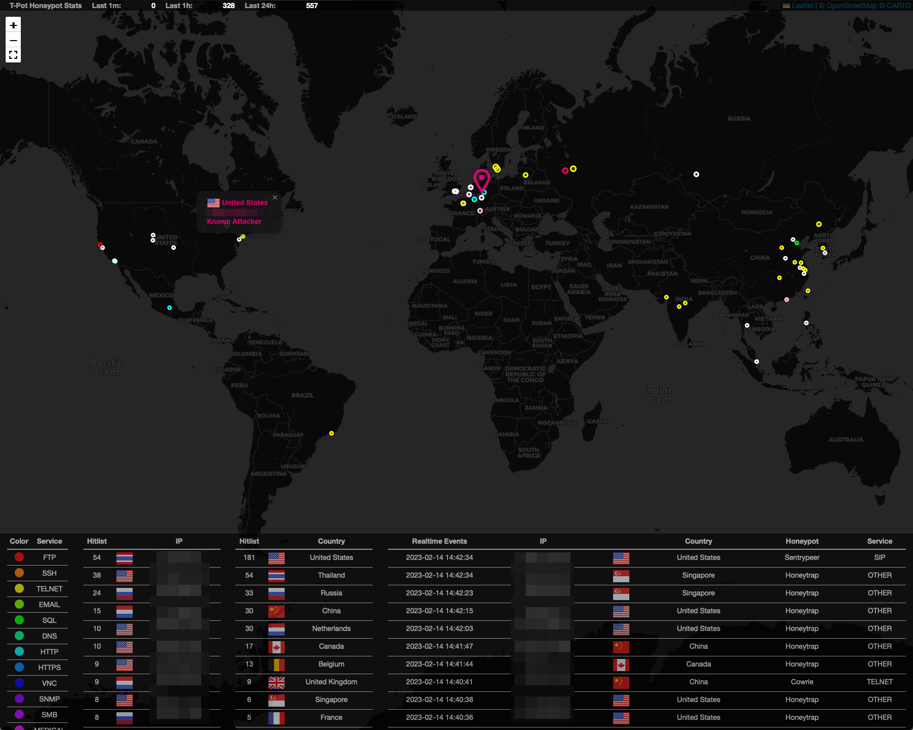

# T-Pot Attack Map

This fork of the GeoIP Attack Map was adjusted for [T-Pot](https://github.com/telekom-security/tpotce), also introducing new features (i.e. dynamic destination IPs to represent T-Pots), better performance for the Attack Map Server by using aiohttp, asyncio and aioredis and, where possible, serving the dependencies locally instead from different CDNs.

### T-Pot Attack Map Visualization
This geoip attack map visualizer was forked and adjusted to display T-Pot Honeypot events in real time. The data server connects to elasticsearch, parses out source IP, destination IP, source port, destination port, timestamp, honeypot type and honeypot statistics (events per last 1m, 1h, 1d). Protocols are determined via common ports, and the visualizations vary in color based on protocol type while keeping stats regarding top source IPs and countries. 

### Credits
The original attack map was created by [Matthew Clark May](https://github.com/MatthewClarkMay/geoip-attack-map). 
First T-Pot based fork was released by [Eddie4](https://github.com/eddie4/geoip-attack-map).

### Licenses / Copyright
[Bootstrap](https://getbootstrap.com/docs/4.0/about/license/), [D3](https://github.com/d3/d3/blob/main/LICENSE), [Flagpack](https://github.com/Yummygum/flagpack-core/blob/main/LICENSE), [JQuery](https://jquery.org/license/), [Leaflet](https://github.com/Leaflet/Leaflet/blob/main/LICENSE), [OpenStreetMap](https://www.openstreetmap.org/copyright). 
